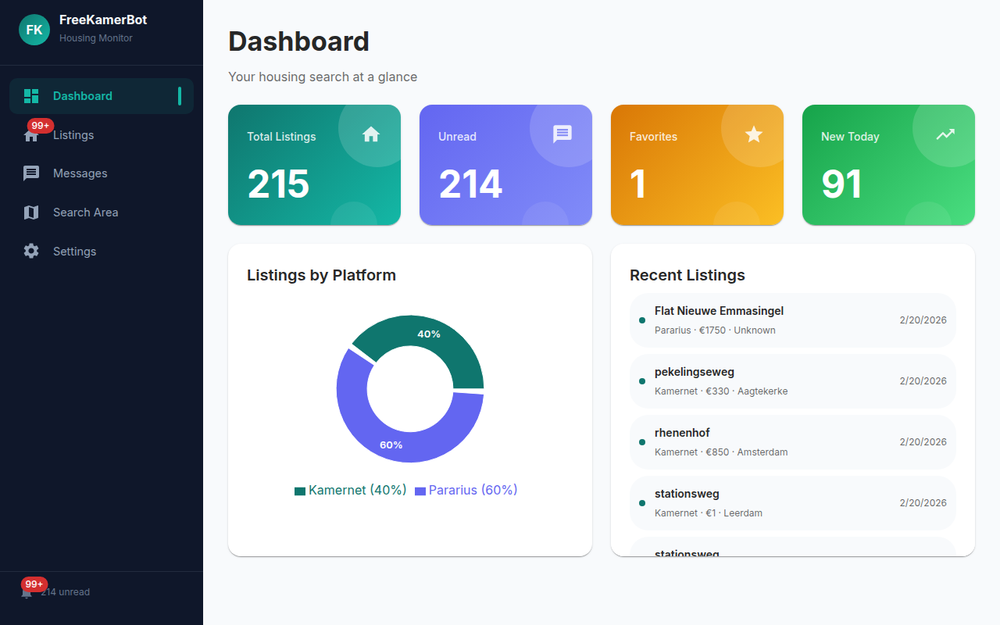

# FreeKamerBot

Monitor Kamernet and Pararius listings in one dashboard with automatic replies and instant notifications.



## Features

- **Listing monitoring** — Scrapes Kamernet and Pararius on a configurable interval and shows new listings in real-time
- **Auto-reply** — Automatically sends a customizable message to new Kamernet listings
- **Search areas** — Draw zones on an interactive map to filter listings by location
- **Notifications** — Desktop (and optional PWA mobile) alerts for new listings and messages
- **Message inbox** — Syncs and displays landlord messages from Kamernet

## Quick Start

```bash
# Install everything
npm run install-all

# Copy and edit config
cp .env.example .env

# Run (starts backend on :3001, frontend on :3000)
npm start
```

Open `http://localhost:3000`.

## Configuration

All settings are editable from the **Settings** page in the UI:

| Setting | Description |
|---|---|
| Kamernet credentials | Email/password for auto-reply and message sync |
| Auto-reply template | Message sent automatically to new listings |
| Filters | Min/max price and size |
| Monitoring intervals | How often each platform is scraped (minutes) |
| Extra sources | Additional Pararius URLs to monitor |
| Notifications | Toggle desktop and mobile push |

## Tech Stack

| Layer | Stack |
|---|---|
| Backend | Node.js, Express, Puppeteer, LowDB, node-cron |
| Frontend | React, Material UI, Recharts, Leaflet |

## Notes

- **Puppeteer**: The installer skips bundled Chromium. Set `PUPPETEER_EXECUTABLE_PATH` in `.env` if your system Chrome isn't auto-detected.
- Use reasonable monitoring intervals to avoid overloading platform servers.
- For personal use only — respect each platform's terms of service.

## License

MIT
